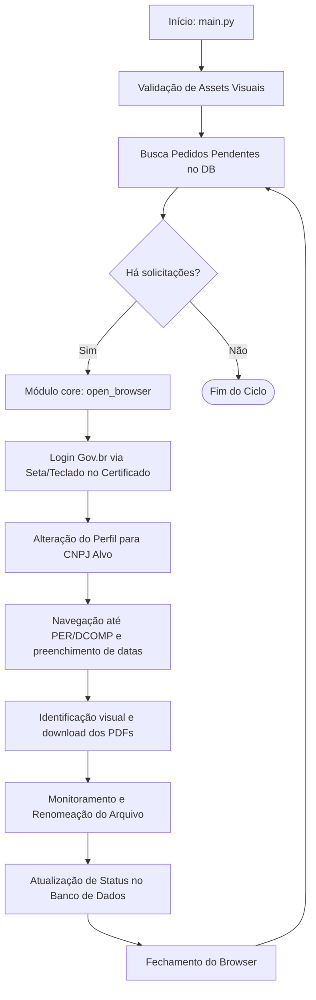

# 🤖 RPA PERDCOMP - Automação eCAC (Receita Federal)

> Robô de Automação de Processos (RPA) híbrido desenvolvido em Python para acessar o portal **eCAC**, realizar login com certificados digitais via **Gov.br**, navegar pelo painel **PER/DCOMP** e realizar o download automático de documentos.

---

## 🚀 Tecnologias e Arquitetura

O projeto utiliza uma abordagem **híbrida** que combina automação estruturada por seletores web com visão computacional para contornar limitações de segurança e componentes de sistema operacional.

*   **Linguagem Core:** Python 3.x
*   **Automação Web estruturada:** [Playwright](https://playwright.dev/python/) para navegação robusta, gerenciamento de sessões, interceptação e auto-wait de elementos DOM.
*   **Automação Visual & UI nativa:** [PyAutoGUI](https://pyautogui.readthedocs.io/) e [OpenCV](https://opencv.org/) (Visão Computacional) para lidar com telas do sistema (pop-ups de Certificado Digital do Windows) e frames seguros inacessíveis pelo DOM.
*   **Banco de Dados:** MySQL (Fila de processamento, parametrização e histórico).
*   **Concorrência:** Multi-threading para monitoramento assíncrono e estabilização de downloads.

---

## 📂 Estrutura do Projeto

```text
rpa_perdcomp/
├── main.py              # Ponto de entrada e orquestração global do ciclo de vida
├── requirements.txt     # Dependências externas do projeto
├── .env                 # Configurações confidenciais (Banco de dados, caminhos)
├── assets/
│   └── images/          # Imagens de referência (templates) para o OpenCV
├── src/
│   ├── core/            # Módulos base:
│   │   ├── browser.py   # Inicialização e controle do processo do Edge
│   │   └── vision.py    # Reconhecimento visual de elementos na tela
│   ├── database/        # Conexão e manipulação do banco (DBHandler)
│   └── workflow/        # Lógica de negócio específica do eCAC/PERDCOMP
└── logs/                # Arquivo de logs da execução e capturas de tela de erros
```

---

## ⚙️ Configuração e Instalação

### 1. Pré-requisitos
*   **Python 3.8+** instalado.
*   **Microsoft Edge** instalado no sistema operacional.
*   **Resolução de Tela:** A resolução e o zoom do sistema/navegador devem estar em **100%** para garantir a precisão do OpenCV.
*   **Mouse e Teclado Livres:** O robô simula ações humanas reais (teclas de direção, cliques coordenados), portanto o computador não deve ser utilizado ativamente durante o ciclo.

### 2. Instalação das Dependências

Instale os pacotes necessários:
```bash
pip install -r requirements.txt
```

Instale os navegadores e dependências do Playwright:
```bash
playwright install
```

### 3. Variáveis de Ambiente
Crie um arquivo `.env` na raiz do projeto contendo as credenciais de acesso ao seu banco de dados e as configurações de caminho:

```env
DB_HOST=seu_host_mysql
DB_USER=seu_usuario
DB_PASS=sua_senha
DB_NAME=seu_banco
DOCUMENTS_PATH=C:/Caminho/Para/Salvar/Downloads
```

---

## 🔄 Fluxo de Funcionamento

O robô opera de forma cíclica e automatizada a partir do arquivo [main.py](file:///c:/Users/rodrigo.fechner/Videos/rpa_perdcomp/main.py):



---

## 📝 Controle de Fila e Status (Banco de Dados)

O robô lê a tabela do banco de dados filtrando por `id_tipo_arquivo = 5` (específico para PERDCOMP) e atualiza os status ao longo do ciclo de vida utilizando os seguintes códigos:

| Status | Nome/Etapa | Descrição técnica |
| :---: | :--- | :--- |
| **8** | **Acessando** | Iniciou a tentativa de autenticação na plataforma. |
| **4** | **Processando** | Superou o login e está ativamente localizando e extraindo os PDFs. |
| **5** | **Sucesso** | Todos os documentos foram baixados e confirmados localmente. |
| **11** | **Sem Eventos** | Não foram encontrados documentos do tipo PERDCOMP no intervalo de datas. |
| **6** | **Erro Técnico** | Falha inesperada, perda de comunicação ou imagem de referência não encontrada. |
| **14** | **Pendência CNPJ** | CNPJ com mensagens de bloqueio na plataforma eCAC. |
| **15** | **CNPJ Inválido** | CNPJ com erro cadastral ou digitação inválida na solicitação. |

---

## 🛠️ Detalhes Técnicos Avançados

### Monitoramento de Downloads Assíncrono (`MonitorDownloads`)
Para evitar que arquivos fiquem corrompidos ou incompletos na pasta de destino, o projeto roda uma **Thread paralela (Daemon)** que observa o diretório temporário do Windows.
- O robô analisa o tamanho do arquivo a cada segundo.
- Se o tamanho do arquivo se mantiver inalterado durante o período de estabilização, o download é considerado concluído.
- O arquivo é então renomeado no padrão corporativo: `CNPJ_NomeOriginal.pdf` e movido para a pasta final configurada no `.env`.

### Sincronização por Visão Computacional
Diferente de automações frágeis baseadas em pausas estáticas (`time.sleep()`), o módulo `vision.py` implementa loops inteligentes de checagem de pixels com tolerância de similaridade ajustável (OpenCV). Isso reduz o tempo de ociosidade do robô ao mínimo necessário para a Receita Federal responder.

---

*Desenvolvido para fins de automação de processos fiscais e de auditoria.*
